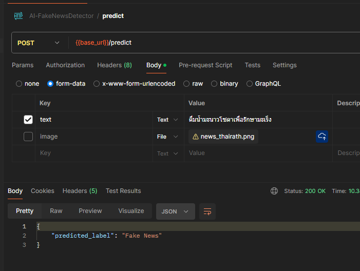

## Description
This is a Thai fake new detechion project (heathcare domain)
using SVM model to classify news into fake or real news
by using the following features
- word frequency
- tf-idf
- ocr text

This repository contains datasets from 
https://github.com/byinth/LimeSoda

## requirements
- python 3.12
- libraries in requirements.txt
- Tesseract-OCR installed
- Thai language pack for Tesseract-OCR installed

## API
predict thai news by sending a post request to /predict
```
{
    "text": "ข่าวปลอม"
}
```
response
```
{
    "prediction": "fake"
}
```
or using image file
```
{
    "image": image_file
}
```
response
```
{
    "prediction": "fake"
}
```


get the model metrics by sending a get request to /metrics


this project inspired by
https://medium.com/@nitsirs/detecting-thai-fake-news-with-machine-learning-5c1bb3430bf3

## License
MIT License

Copyright (c) 2024 Anupat Kaewmee

Permission is hereby granted, free of charge, to any person obtaining a copy
of this software and associated documentation files (the "Software"), to deal
in the Software without restriction, including without limitation the rights
to use, copy, modify, merge, publish, distribute, sublicense, and/or sell
copies of the Software, and to permit persons to whom the Software is
furnished to do so, subject to the following conditions:

The above copyright notice and this permission notice shall be included in all
copies or substantial portions of the Software.

THE SOFTWARE IS PROVIDED "AS IS", WITHOUT WARRANTY OF ANY KIND, EXPRESS OR
IMPLIED, INCLUDING BUT NOT LIMITED TO THE WARRANTIES OF MERCHANTABILITY,
FITNESS FOR A PARTICULAR PURPOSE AND NONINFRINGEMENT. IN NO EVENT SHALL THE
AUTHORS OR COPYRIGHT HOLDERS BE LIABLE FOR ANY CLAIM, DAMAGES OR OTHER
LIABILITY, WHETHER IN AN ACTION OF CONTRACT, TORT OR OTHERWISE, ARISING FROM,
OUT OF OR IN CONNECTION WITH THE SOFTWARE OR THE USE OR OTHER DEALINGS IN THE
SOFTWARE.