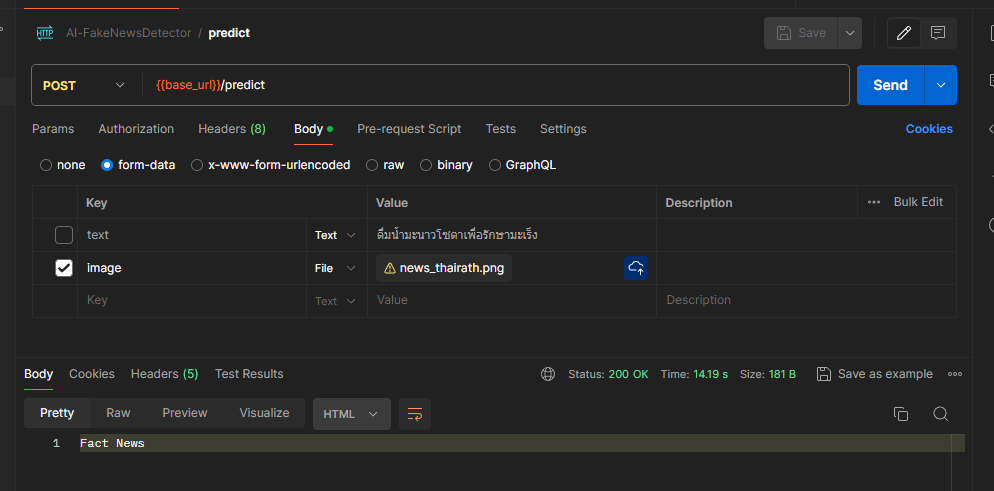
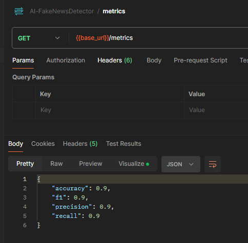

## Description
This is a Thai fake new detechion project (heathcare domain)
using SVM model to classify news into fake or real news
by using the following features
- word frequency
- tf-idf
- ocr text


This repository contains datasets from 
https://github.com/byinth/LimeSoda

## requirements
- python 3.12
- libraries in requirements.txt
- Tesseract-OCR installed
- Thai language pack for Tesseract-OCR installed

## API
predict thai news by sending a post request to /predict
```
{
    "text": "ข่าวปลอม"
}
```
response
```
{
    "prediction": "fake"
}
```
or using image file
```
{
    "image": image_file
}
```
response
```
{
    "prediction": "fake"
}
```


get the model metrics by sending a get request to /metrics


this project inspired by
https://medium.com/@nitsirs/detecting-thai-fake-news-with-machine-learning-5c1bb3430bf3